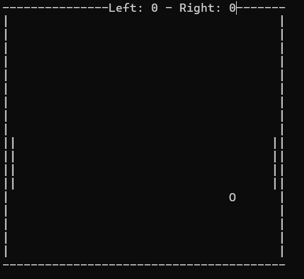
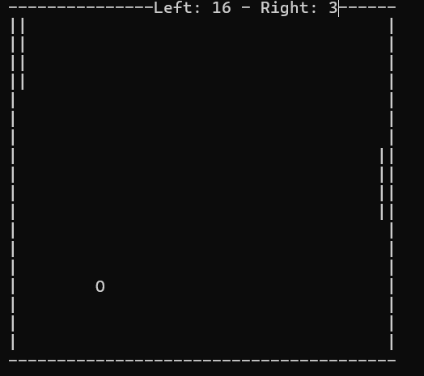
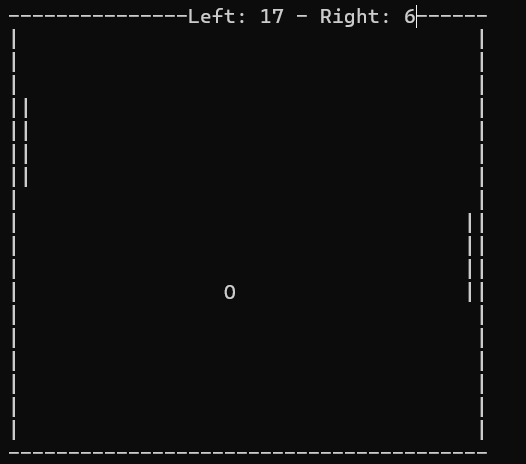

# PingPong

PingPong is a classic two-player Pong game written in pure C#, playable directly in the console.

## Features

- **Two-player mode:** Compete head-to-head.
- **Controls:**  
  - Left player: **W** (up) & **S** (down)  
  - Right player: **↑** (up arrow) & **↓** (down arrow)
- **Score system:** See who can score the most points!
- **Simple console graphics:** Retro style!

## Controls

| Player   | Keys         |
|----------|--------------|
| Left     | W / S        |
| Right    | ↑ / ↓        |

## Screenshots

Game screenshots are located in the `images` folder:





## How to Run

1. Clone the repository:
    ```bash
    git clone https://github.com/ivanshevchuk0/PingPong.git
    ```
2. Open the project in your favorite C# IDE (e.g., Visual Studio).
3. Build and run the project.

## Requirements

- .NET Framework or .NET Core (project version dependent)
- Windows console or compatible terminal

## Author

[ivanshevchuk0](https://github.com/ivanshevchuk0)

---

Feel free to open issues or pull requests!
